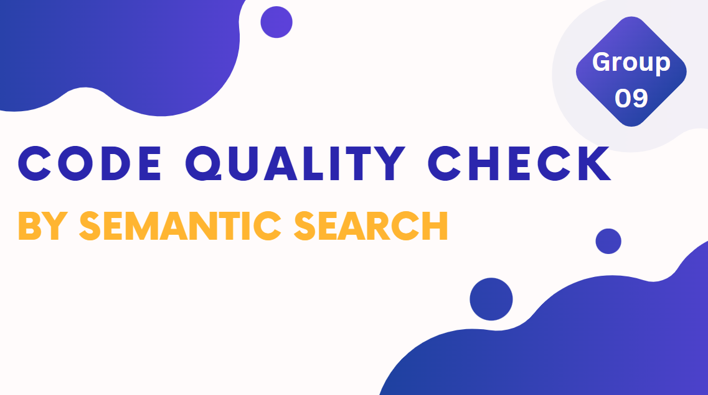

[comment]: # "This is the standard layout for the project, but you can clean this and use your own template"

# Code Quality Check With Semantic Search

---

# Team
-  E/18/276, Jayathu, [email](mailto:e18276@eng.pdn.ac.lk)
-  E/18/382, Denuwan, [email](mailto:e18382@eng.pdn.ac.lk)
-  E/18/412, Sanjaya, [email](mailto:e18412@eng.pdn.ac.lk)

# Table of Contents
1. [Introduction](#introduction)
2. [Other Sub Topics](#other-sub-topics)
3. [Links](#links)

---

# Introduction

 Code checking is essential to ensure collaboration, reliability, maintenance, readability, and extendability of code. However, manual code review is time-consuming, subjective, and prone to errors. To address these challenges, a proposed solution is to develop a deep neural network utilizing semantic analysis for code quality evaluation. This approach aims to provide a language-independent and contextually understanding system that can classify code as good or bad, ensuring consistency, readability, maintainability, and overall quality.

### How does this solve the problem at hand?

- Automated Code Analysis
- Semantic analysis
- Different programming languages
- Processing of large code base
- Code suggestions based on semantic search

### High level system diagram

# Development

## Gathering Data
We have gathered a diverse dataset of over 2000 sample code snippets from various sources. This dataset serves as the foundation for our code quality checker.

## Labeling
We meticulously labeled each code snippet using `pylint` to assess their quality based on the following criteria:
- Convention
- Error
- Code Duplication
- Complexity
- Code Design

## Model Training
For the model, we leveraged BERT (Bidirectional Encoder Representations from Transformers) to train our code quality checker. BERT is a powerful language model that enables us to perform semantic search and evaluate code quality effectively.

Our trained model can now analyze code snippets and determine whether they are good or bad based on the criteria mentioned above.

# Links

- [Project Repository](https://github.com/cepdnaclk/{{ page.repository-name }}){:target="_blank"}
- [Project Page](https://cepdnaclk.github.io/{{ page.repository-name}}){:target="_blank"}
- [Department of Computer Engineering](http://www.ce.pdn.ac.lk/)
- [University of Peradeniya](https://eng.pdn.ac.lk/)

[//]: # (Please refer this to learn more about Markdown syntax)
[//]: # (https://github.com/adam-p/markdown-here/wiki/Markdown-Cheatsheet)
